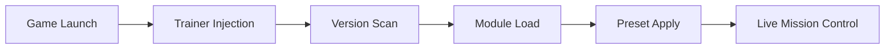

## HELLDIVERS 2 Trainer — Order in the Middle of Fire

The sky burns.
Orbit cracks open.
Democracy falls from above like thunder.

The **HELLDIVERS 2 Trainer** is not rebellion — it is *discipline*. A quiet system beneath the chaos, helping every drop, every reload, every desperate stand feel intentional rather than exhausting.

Engineered for veterans of **HELLDIVERS 2**, this trainer refines the experience without muting its brutality. You still bleed. You still fight. You simply waste less time doing it.

---

## 🧭 Overview — What This Trainer Represents

This software acts as a **real-time gameplay adjustment layer**, attaching only while the game runs. No permanent changes. No rewritten files. Just live control where it matters most.

**Design principles:**

* Preserve challenge, remove friction
* Empower coordination and flow
* Allow instant rollback at any moment

It is not about godhood — it is about *command*.

---

## 🎯 Combat Control & Survivability

Every battlefield is a math problem solved under fire.

The combat module sharpens margins without erasing danger.

**Combat-focused options:**

* Adjustable player damage multipliers 🎯
* Infinite or scaled stamina
* No reload / infinite ammo toggles
* Invulnerability (optional, isolated)
* Friendly-fire override (local sessions)

Sliders replace brute switches, allowing subtle tuning instead of reckless excess.

> [!IMPORTANT]
> Combat cheats can be configured per mission to maintain difficulty escalation.

---

## 👁 Awareness, Enemies & Battlefield Insight

HELLDIVERS 2 overwhelms by design.
This trainer brings *clarity*.

**Awareness features include:**

* Enemy health visibility 👁
* Threat distance indicators
* Objective markers through terrain
* Stratagem cooldown display

Overlays remain minimalist, fading naturally with distance to preserve immersion.

---

## 🎒 Stratagems, Items & Resource Flow

Calling support should feel empowering — not punishing.

**Utility enhancements:**

* Instant stratagem cooldowns
* Infinite grenades & stims (toggle-based)
* Mission timer control
* Resource and requisition tuning

Perfect for testing loadouts, practicing high-difficulty drops, or experimenting freely without penalty.

> [!NOTE]
> Resource changes can be session-only, leaving long-term progression intact.

---

## ⚡ Setup — Drop Fast, Drop Clean

No bureaucracy. No delay.

```text
1. Launch HELLDIVERS 2
2. Run the Trainer as administrator
3. Press INSERT to open the menu
4. Enable desired modules
5. Deploy
```

No save corruption.
No leftover files.
The trainer exits with the mission.

---

## 🛠 Presets, Hotkeys & Control Philosophy

Every squad fights differently.

**Customization system includes:**

* Multiple saveable presets
* Per-feature hotkey binding
* Live parameter adjustment
* One-key emergency disable

From gentle assistance to full tactical override — control remains deliberate and reversible.

---

## 🔁 Internal Operation Flow



---

## ❓ FAQ — Briefings Before the Drop

**Is this trainer safe to use?**
Yes, for offline or private play. It operates in memory only.

**Will it ruin co-op balance?**
Only if misused. Most squads apply light tuning for testing or practice.

**Can I disable everything instantly?**
Yes — a panic key restores default gameplay immediately.

**Does it interfere with stratagem inputs?**
No. All controller and keyboard commands remain intact.

**Are updates frequent?**
Yes. Updates follow major game patches closely.

---

## 🌍 Final Thoughts — Managed Chaos

HELLDIVERS 2 is not about comfort.
It is about control under pressure.

The **HELLDIVERS 2 Trainer** does not soften the war — it sharpens your command of it. A tool for players who love the chaos, but refuse to drown in it.

Orders received.
Pods loaded.
Democracy awaits.

---
